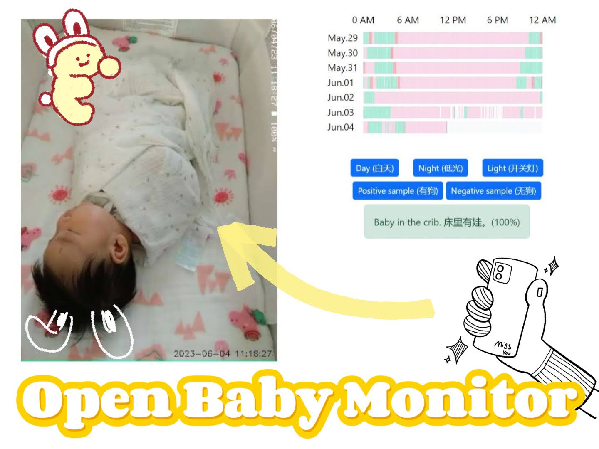

# Open Baby Monitor

An open-source baby monitor that uses ~~a stereo camera~~ an Android phone to provide a live video feed of the baby's crib, so I can keep an eye on the little thing while working. I also want to track the baby's sleep and send out alerts if necessary.

Goals:
 - [x] A password protected live video feed of the baby's crib
 - [x] Detects the baby's movement using temporal information
 - [x] Simple camera control, like auto-focus, toggle flashlight, save image.
 - [x] Detects if the baby is in the crib
 - [ ] Automatically logs her sleep duration and quality
 - [ ] Detects if the baby's airway is obstructed (face down or covered)
 - [ ] Tracks the room temperature and humidity, so I can analyze any correlation with the baby's sleep quality
 - [ ] ~~Detects the baby's movement using depth information~~



## Setup

### Install requirements
```bash
python -m pip install -r requirements.txt
```

### Run

```bash
python streaming_server.py
# ./ngrok http 5000
# gunicorn --workers 1 --threads 1 --bind 0.0.0.0:5000 streaming_server:app
```

### TODO:
 - [x] Password protect the web app (flask_httpauth)
 - [x] Broadcast to the internet with ngrok
 - [x] Multi-camera switching
 - [x] Use uuid to store session specific data like selected camera
 - [x] Support Android phone's better low-light camear via IP Webcam
 - [x] Now handles disconnection and automatic reconnection
 - [x] Image data collection now works
 - [x] Add a button to take a picture
 - [x] "baby in crib" detection model via Google's [Teachable Machine](https://teachablemachine.withgoogle.com/)
 - [x] The light now turns off after 10 seconds
 - [ ] Add a button to record a video
 - [ ] An infrared camera for the dark would be nice


### References:
 - [DepthAI to support the OAK-D stereo camera](https://docs.luxonis.com/en/latest/pages/tutorials/first_steps/#first-steps-with-depthai)
 - [DroidCam controls](https://github.com/AiueoABC/Play_with_DroidCam/blob/master/capture.py)
 - [IP Webcam control](https://community.home-assistant.io/t/android-ip-webcam-as-a-camera-plus-sensors/10566)

### License


### Notes:

 - The OAK-D stereo camera is nice to have, but my old Pixel 2 phone provides much better low-light performance, so I switched to using the phone as the camera.

 - user name and pin are saved in the environment variables (.env), add this file to .gitignore to avoid saving sensitive information in the code repository

 - Mac OS Catalina ssh issue: https://discussions.apple.com/thread/253932000. In Terminal, type in and execute the following: `sudo launchctl load -w /System/Library/LaunchDaemons/ssh.plist`
